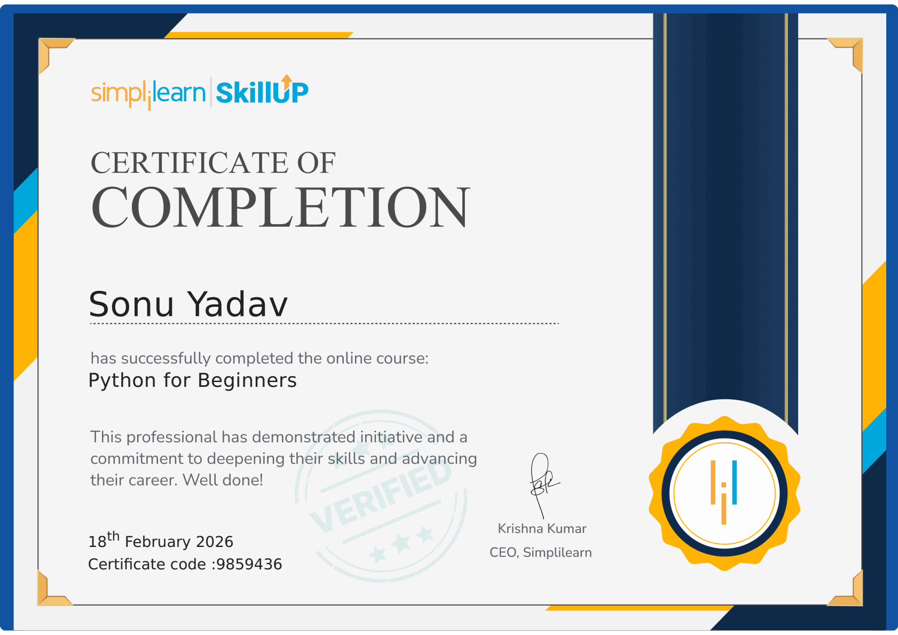

<h1 align="left">Hi 👋, I'm Sonu Yadav</h1>

  🧑‍💻 <b>Backend-Focused Web Developer | C++ • Python • PHP • MySQL | Frontend Basics

---
<!-- Left Side Content -->

## 🛠️ Skills

### 🎨 Frontend Developer

---

### ⚙️ Backend Developer

<!-- ================= CERTIFICATIONS ================= -->

## 🏆 Certifications

  

  <b>🎓 Python for Beginners — Simplilearn SkillUp</b> 
  📅 Completed: <b>18 Feb 2026</b> &nbsp; | &nbsp;
  🔐 Certificate Code: <b>9859436</b>

  
  

<!-- ================================================== -->

<!-- Right Side Image -->

  

---
### 📁 Projects

- ✅ Calculator Web in HTML, CSS and JS
- ✅ Student Record System using File Handling (C++)  
- ✅ Sweet Shop Website (HTML, CSS, JS)
- ✅ Weather Wed in HTML,CSS and JS
- ✅ QR-Generator Web in HTML,CSS and JS

---
### 📬 Contact Me

  

---
### 💡 Hobbies

- 🌱 Learning new tech daily  
- 👨‍💻 Writing code & debugging  
- 🎧 Listening to music while coding  
- 🤖 Exploring AI & Automation

---
### 🧠 Quote I Believe In

> “Success is not final, failure is not fatal: It is the courage to continue that counts.”  
> — Winston Churchill

</td>

<!-- Right Side Image -->

